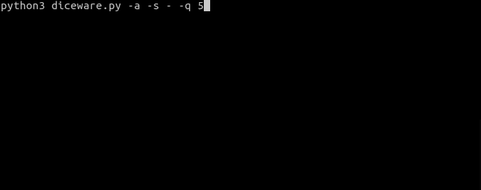

## Features
 - Generate cryptographically secure passphrases using the diceware technique
 - CLI interface
 - Accepts custom wordlist
 - Custom passphrase properties (# words, # symbols, # numbers, customer spacer character(s))

## Screenshots

> Application demo

## Requirements and Installation
 - [Python 3.7+](https://www.python.org/)
 - Compatible with [EFF wordlists](https://www.eff.org/deeplinks/2016/07/new-wordlists-random-passphrases).
    - If using custom wordlist, use format:
    
            Number\tWordCR
    
        - 'Number' represents the 5 digit dice roll (5x(1-6))
        - '\t' represents a tab
        - 'Word' represents the number's corresponding word
        - 'CR' represents a carriage return.
        - E.g.
        
                24463	earthling
                24464	earthly
                24465	earthworm
                24466	earthy

## Arguments

#### Optional arguments:
  - `-nW` or `--words`
    - Specify number of words to be generated
    - Default: 6
    - Recommended: >=6
  
  - `-nS` or `--symbols`
    - Specify number of symbols to be generated
    - **NOTE**: Symbols were carefully selected to ensure application on all keyboards and for readability. The symbol used as a spacer is not reused as a symbol in the passphrase.
    - Default: 2
  
  - `-nN` or `--numbers`
    - Specify number of numbers to be generated
    - Default: 2
  
  - `-a` or `--append`
    - Append numbers to the end of words/symbols instead of keeping them separate
    - E.g. Enabled: word1 %2 word
    - E.g. Disabled: word 1 % 2 easiest
    - Default: Disabled
    - Recommended: Enabled
  
  - `-w` or `--wordlist`
    - Specify a custom wordlist to use (see requirements for wordlist format)
    - Default: 'eff_large_wordlist.txt' in same directory as 'diceware.py'
  
  - `-s` or `--separator`
    - Specify a separator to use between words/numbers/symbols
    - Default: " " (Space)
  
  - `-q` or `--quantity`
    - Specify the number of passphrases to generate
    - Default: 1
  
  - `--version`
    - Display program version

## Usage
 - Run 'diceware.py' in terminal with arguments (see above)

## Changelog
#### Version 1.0 - Initial release
 - Generate cryptographically secure passphrases using the diceware technique
 - CLI interface
 - Accepts custom wordlist
 - Custom passphrase properties (# words, # symbols, # numbers, customer spacer character(s))
 
## Future Developments
 - Add a GUI for ease of use
 - Increase flexibility in wordlist formatting
 - Calculate password entropy
 - Add mode for easy output
 - Add integrity check for program
 - Add mode to show only dice rolls

